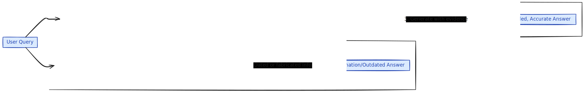

# Introduction

Imagine if an AI could answer your questions not just from what it was trained on, but also from fresh, real-time information—like your resume, notes, or even a database. That’s the promise of Retrieval-Augmented Generation (RAG), a method that bridges the gap between static AI models and dynamic, up-to-date knowledge.

In this post, we’ll explore how RAG works in plain language, why it’s useful, and how I used it to create my [old portfolio website](https://shaah1d-v0.vercel.app/) that can answer questions about my experience. No technical deep-dives required—just an intuitive understanding of the power behind this approach.


## What is Retrieval-Augmented Generation (RAG)?

Retrieval-Augmented Generation (RAG) is a way to supercharge language models like ChatGPT by letting them look things up before answering. Traditional AI models rely on what they learned during training, which means they can miss recent or context-specific information. RAG fixes this by giving the model access to an external source of truth.

Think of it like this: if you’re asked a question about a specific book, you might first flip through the book to find the answer instead of relying on memory alone. That’s exactly what RAG does.

<figure>
  <div>
    
    
  </div>
  <figcaption className="text-center text-sm text-gray-600 dark:text-gray-400 mt-2">
    Visualization of the above example
  </figcaption>
</figure>

### How RAG Works

What basically happens under the hood is this:

A big document of text on a particular topic is taken (the topic can be anything you want the model to be trained on). This large document is then split into smaller chunks using a text splitter function — libraries like [LangChain](https://js.langchain.com/docs/concepts/text_splitters/) provide this feature.

All these smaller chunks of text are then converted from plain text into [vector embeddings](https://www.pinecone.io/learn/vector-embeddings/). These embeddings are just lists of numbers that represent the meaning of the text. These embeddings are heavily used in recommendation systems, semantic searches and more.

Now, when a user asks a question, that question is also converted into a vector embedding. To find the most relevant answer, the system compares the question’s embedding with all the document chunk embeddings using something called [cosine similarity](https://en.wikipedia.org/wiki/Cosine_similarity). The chunk with the closest match is selected and used to generate the answer.

 <figure className="my-4">
     
     <figcaption className="text-center">
       **Source**: [DeepAI](https://arxiv.org/pdf/1910.03375v1).<br />
     
     </figcaption>
     <figcaption>
     **Explanation**: Figure 1 shows how sentences can be represented as dots in a multi-dimensional space (top image). Each dot is a sentence, and related sentences are connected by arrows. The dashed arrows show different kinds of relationships between sentences.
 Figure 2 shows all the arrows starting from the same point, this is called "space of operations". Here, we're focusing on how sentences change from one to another (like “running” instead of “walking”). Similar type of changes form a tight group in the space.
     </figcaption>
   </figure>


### Why Use RAG?

RAG addresses key limitations of traditional LLMs:
- **Contextual Accuracy**: By retrieving relevant information to the question, RAG ensures that teh responses are accurate and reduces the risk of hallucinations (making up answers).
- **Customizability**: The customizability of RAG allows devs to train models on whatever type or data the dev has which makes it extremely versatile for niche applications such as a specific company or software's knowledge base.
- **Scalability**: As by cosine similarity only the chunks nearest to the question are retrieved, it allows for efficient proccessing even if the datasets are large.
- **Up-to-date Information**: As the models are updated by the devs its easier to keep it updated to a specific niche on a regular basis making it very effective.

## A Real-World Example: My AI-Powered Portfolio

To illustrate RAG in action, let’s explore my [old portfolio website](https://shaah1d-v0.vercel.app/), a Next.js application that uses RAG to answer questions about my skills, projects, and experiences based on my resume. The project integrates **LangChain**, **Supabase**, and **OpenAI** to create an interactive, conversational interface. Here’s how it works, with a focus on the RAG implementation.
If you wish to follow along here is the [GitHub repository](https://github.com/shaah1d/portfolio)

### Project Overview

The portfolio allows users to ask questions (e.g., “What projects has Shaahid worked on?”) through a form (`QuestionPrompt.tsx`). The system retrieves relevant sections from my resume, stored as a text file (`word.txt`), and generates a response using RAG. The response is displayed and converted to audio using OpenAI’s text-to-speech API for an engaging user experience.

### RAG Implementation in the Portfolio

The RAG pipeline is implemented in `src/app/api/chain/route.ts`. Here’s a step-by-step breakdown:

1. **Resume Processing**:
   - My resume, stored in `public/word.txt`, contains details about my skills, projects (e.g.,*Womens safety application*, *Kuesuto*), and experiences.
   - The resume is split into smaller chunks using **LangChain**’s text-splitting utilities. This ensures manageable pieces for embedding and retrieval.
   - Each chunk is converted into a vector embedding using **OpenAIEmbeddings** and stored in a **Supabase** vector database (table: `documents`, query: `match_documents`).

2. **Retrieval Pipeline**:
   - When a user submits a question via `QuestionPrompt.tsx`, it’s sent to the `/api/chain` endpoint as a JSON payload.
   - The question is converted into a standalone query using a **PromptTemplate** (`standAloneQuestionTemplate`) and processed by **ChatOpenAI** to ensure clarity.
   - The standalone query is embedded and compared to the resume’s vector embeddings in Supabase using **SupabaseVectorStore**. The most relevant chunks are retrieved based on cosine similarity.
  

3. **Generation Pipeline**:
   - The retrieved resume chunks are combined into a single context string using a custom `combineDocuments` function.
   - A second **PromptTemplate** (`answerTemplate`) instructs the LLM to answer as me (Shaahid) in a polite, professional tone, using only the provided context. For example:
   
 
     ```json
     You are Shaahid and you have to answer all the questions in first person based on the context provided to you...
     context: {context}
     question: {question}
     answer:  // the answer to the question will be generated here according to the context and the tonality of the question.
     ```

   - The **ChatOpenAI** model generates a response, which is parsed into a string using **StringOutputParser**.
   

4. **Response Delivery**:
   - The generated response is returned to the frontend (`Firstchain.tsx`) and displayed to the user.
   - Simultaneously, the response is sent to `/api/speech`, where **OpenAI’s tts-1** model (voice: `echo`) converts it to audio, played via an `<audio>` element in `speech.tsx`.

### Code Example

Here’s a simplified version of the RAG chain from `src/app/api/chain/route.ts`:

```typescript
import { NextResponse } from 'next/server';
import { ChatOpenAI, OpenAIEmbeddings } from '@langchain/openai';
import { PromptTemplate } from '@langchain/core/prompts';
import { SupabaseVectorStore } from '@langchain/community/vectorstores/supabase';
import { StringOutputParser } from '@langchain/core/output_parsers';
import { createClient } from '@supabase/supabase-js';
import { RunnableSequence } from '@langchain/core/runnables';

const combineDocuments = (docs) => docs.map(doc => doc.pageContent).join('\n\n');

export async function POST(request) {
  try {
    const { question } = await request.json();
    if (!question) return NextResponse.json({ error: 'Question is required' }, { status: 400 });

    const client = createClient(process.env.SUPABASE_URL, process.env.SUPABASE_SERVICE_KEY);
    const embeddings = new OpenAIEmbeddings({ openAIApiKey: process.env.OPEN_AI_API_KEY });
    const vectorStore = new SupabaseVectorStore(embeddings, { client, tableName: 'documents', queryName: 'match_documents' });

    const llm = new ChatOpenAI({ openAIApiKey: process.env.OPEN_AI_API_KEY });
    const standaloneQuestionPrompt = PromptTemplate.fromTemplate('Given a question, convert it to a standalone question. question: {question}');
    const answerPrompt = PromptTemplate.fromTemplate('You are Shaahid... context: {context}\nquestion: {question}\nanswer:');

    const standaloneQuestionChain = standaloneQuestionPrompt.pipe(llm).pipe(new StringOutputParser());
    const retrieverChain = RunnableSequence.from([
      prevResult => prevResult.standalone_question,
      vectorStore.asRetriever(),
      combineDocuments,
    ]);
    const answerChain = answerPrompt.pipe(llm).pipe(new StringOutputParser());

    const chain = RunnableSequence.from([
      { standalone_question: standaloneQuestionChain, original_input: new RunnablePassthrough() },
      { context: retrieverChain, question: ({ original_input }) => original_input.question },
      answerChain,
    ]);

    const response = await chain.invoke({ question });
    return NextResponse.json({ success: true, response });
  } catch (error) {
    return NextResponse.json({ success: false, error: error.message }, { status: 500 });
  }
}
```
 When a `POST` request is made, the question is first extracted from the request body. After that, a Supabase client is initialized using credentials stored in environment variables. The `OpenAIEmbeddings` model is used to embed both the stored documents and the user’s query. These embeddings are managed in a Supabase vector store, which handles similarity search using a table called `documents`.

The main logic is built using LangChain’s `RunnableSequence`. First, the question is rewritten into a more standalone version using a prompt and OpenAI’s chat model. Then, this refined question is passed through the retriever, which searches the vector store for the most relevant documents. These retrieved chunks are then passed into another prompt, along with the original question, to generate a final answer. Everything is piped together step by step, and the final output is returned as a JSON response. If anything fails, the error is caught and sent back with a `500` status code.


## Conclusion

RAG is a game-changer for building intelligent, context-aware AI applications. My portfolio demonstrates how RAG, combined with modern web technologies like Next.js and Supabase, can create a dynamic and engaging user experience. By training a model on my resume, I’ve built a tool that not only showcases my skills but also highlights my ability to integrate cutting-edge AI into practical applications. I hope this inspires you to explore RAG for your own projects!

Check out the source code for my portfolio on [GitHub](https://github.com/shaah1d/portfolio) or reach out to me at [writetoshaahid@gmail.com](mailto:writetoshaahid@gmail.com) to discuss RAG, AI, or potential collaborations. Happy coding!